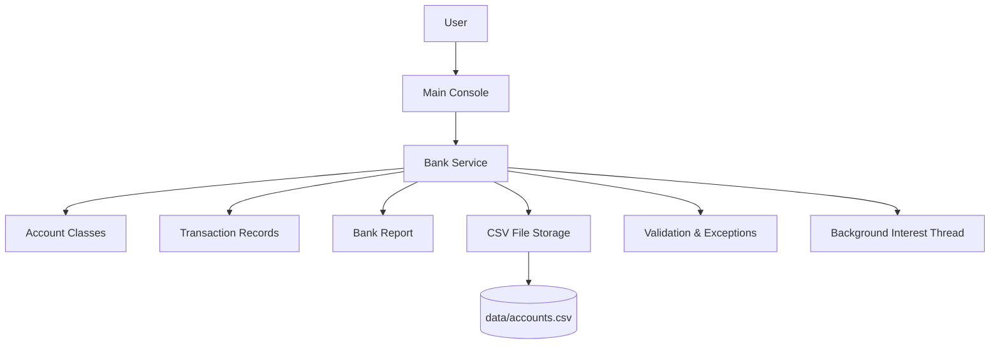
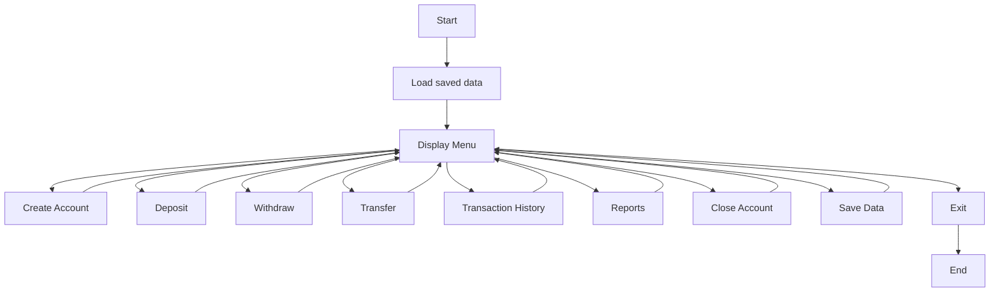
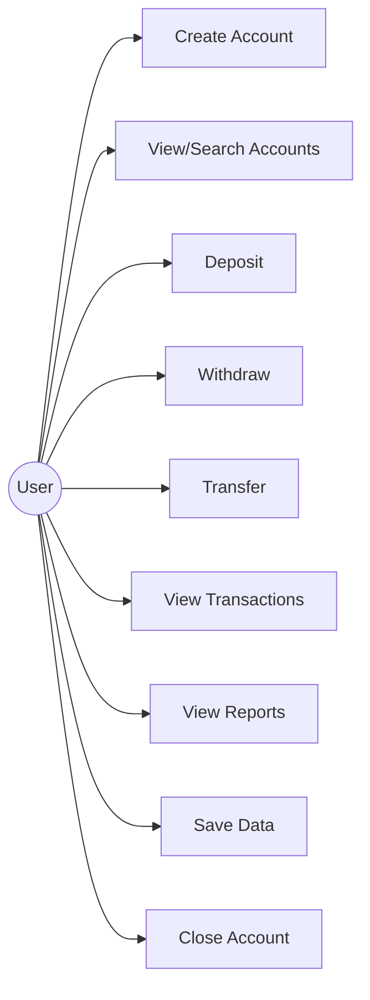
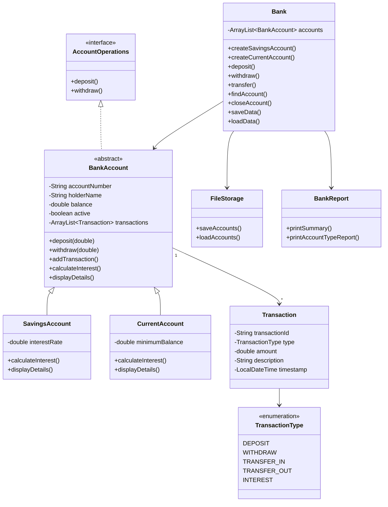
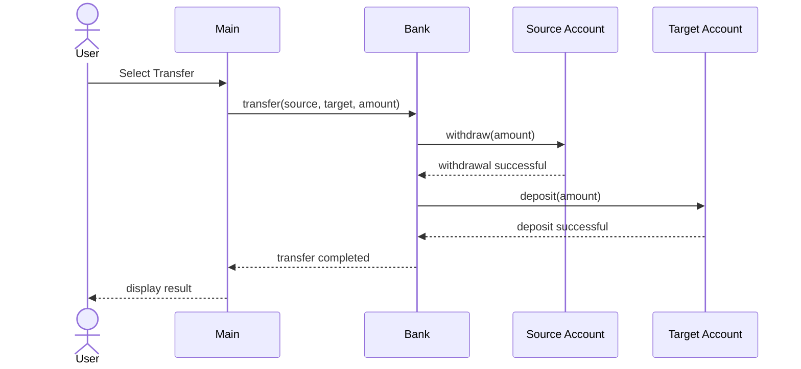

# Design Diagrams

The diagrams below are written in Mermaid notation for documentation. They are not required for running the Java program.

## 1. System Architecture



## 2. Workflow



## 3. Use Case Diagram



## 4. Class Diagram



## 5. Sequence Diagram – Transfer



## 6. Storage Design

CSV file:

```text
accountNumber,accountType,holderName,balance,active,extraValue
```

Where `extraValue` represents the savings interest rate or current-account minimum balance.

Transaction history is kept in memory during the current run. Account balances and basic account information are persisted to CSV.
